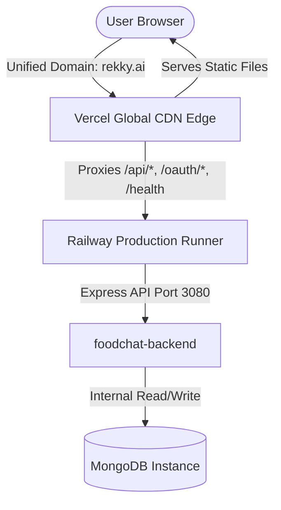

# Rekky: Production Deployment Documentation

This document serves as the permanent technical record and operational runbook for the production deployment of the **Rekky** (LibreChat fork) full-stack monorepo.

---

## 🚀 Live Environment Links

* **Production Frontend**: [https://rekky.ai](https://rekky.ai)
* **Production API Gateway**: [https://foodchat-backend-production.up.railway.app](https://foodchat-backend-production.up.railway.app)
* **Unified Health Gateway**: [https://rekky.ai/health](https://rekky.ai/health) (Proxies seamlessly to Railway; returns `OK`)

---

## 🏛️ Deployment Architecture

To support secure sessions with `SameSite: strict` cookies (`refreshToken` and `token_provider`) and eliminate CORS preflight/cross-origin complexities, we established a **Unified Domain Architecture**:



* **Unified Domain Resolution**: All client-side network calls are routed directly to the same host (`https://rekky.ai`).
* **CDN Reverse Proxying**: Vercel acts as a reverse proxy at the edge. Requests to `/api/*`, `/oauth/*`, `/images/*`, and `/health` are transparently rewritten and forwarded over HTTP/2 to the live Railway container.
* **Cookie Transmission**: Because requests appear same-origin to the browser, secure HTTP-only cookies are passed seamlessly without cross-site blocking.

---

## 💻 Frontend Configuration (Vercel)

The React Single Page Application (SPA) is hosted on Vercel under the **`sahil-vermas-projects-780c3066`** team workspace.

### 1. Root Configuration: `vercel.json`
Located at the root of the repository, [vercel.json](file:///home/sahil/projects/foodchat/vercel.json) configures Vercel to compile only the client packages and establishes the edge rewrites:
```json
{
  "version": 2,
  "installCommand": "node config/prepare-vercel.js && npm install",
  "buildCommand": "npx turbo run build --filter=@librechat/frontend...",
  "outputDirectory": "client/dist",
  "framework": "vite",
  "cleanUrls": true,
  "rewrites": [
    {
      "source": "/api/:path*",
      "destination": "https://foodchat-backend-production.up.railway.app/api/:path*"
    },
    {
      "source": "/oauth/:path*",
      "destination": "https://foodchat-backend-production.up.railway.app/oauth/:path*"
    },
    {
      "source": "/images/:path*",
      "destination": "https://foodchat-backend-production.up.railway.app/images/:path*"
    },
    {
      "source": "/health",
      "destination": "https://foodchat-backend-production.up.railway.app/health"
    },
    {
      "source": "/((?!api|oauth|images|health).*)",
      "destination": "/"
    }
  ]
}
```

### 2. Files Ignored: `.vercelignore`
[vercel.ignore](file:///home/sahil/projects/foodchat/.vercelignore) excludes stateful backend directories, local databases (`data/`, `data-node/`), and lockfiles. This prevents permission violations during Vercel's automated directory scanning.

### 3. Vercel Preparer: `config/prepare-vercel.js`
Runs automatically during the `installCommand` stage. Because Vercel only hosts static files, the preparer dynamically strips the `"api"` workspace from the root `package.json` and deletes backend compilation steps from `turbo.json`. This isolates the client build and prevents Turborepo initialization failures on missing packages.

---

## 🗄️ Backend & Database Configuration (Railway)

The stateful Express API and MongoDB instance are hosted on **Railway** under the **`vrsa`** account workspace.

### 1. Railway Project Details
* **Project ID**: `e8dec199-60ee-407a-8413-082030c41037`
* **Linked Git Repository**: `sahilvermadev/foodchat`
* **Linked Service**: `foodchat-backend`

### 2. Environment Variables Configured on `foodchat-backend`
| Variable | Value / Binding | Description |
| :--- | :--- | :--- |
| `MONGO_URI` | `${{MongoDB.MONGO_URL}}` | Dynamic reference to the linked MongoDB service instance connection string |
| `PORT` | `3080` | Production listener port |
| `HOST` | `0.0.0.0` | Bound host enabling Railway ingress router matching |
| `DOMAIN_CLIENT` | `https://rekky.ai` | Target client origin (used for email validation and app redirections) |
| `DOMAIN_SERVER` | `https://rekky.ai` | Proxied server origin (passed as callback base in OAuth flows) |
| `JWT_SECRET` | `16f8...09ef` | Cryptographic secret for signing JWT access tokens |
| `JWT_REFRESH_SECRET` | `eaa5...8418` | Cryptographic secret for signing refresh tokens |
| `CREDS_KEY` | `f34b...66f0` | Database credentials encryption key |
| `CREDS_IV` | `e234...bfb` | Database credentials initialization vector |
| `ALLOW_UNVERIFIED_EMAIL_LOGIN` | `true` | Standard user authentication permissions bypass override |
| `ALLOW_REGISTRATION` | `true` | Enables/disables the email sign-up/registration form on the login screen |
| `OPENROUTER_KEY` | `sk-or-...` | API Key for custom OpenRouter endpoints (Gemini, Llama, Claude, GPT) |
| `TAVILY_API_KEY` | `tvly-...` | API Key for Tavily advanced web search and markdown scraping integration |

---

## 🧠 Key Technical Resolutions

During the deployment lifecycle, the following critical challenges were resolved:

### 1. Winston Daily Rotate File Constructor Error
* **Problem**: Node crashed on container boot with `TypeError: winston.transports.DailyRotateFile is not a constructor`. Because `winston` is treated as an external dependency by Rollup, the bare side-effect import `import 'winston-daily-rotate-file'` failed to bind to `winston.transports` at bundle runtime due to module isolation.
* **Solution**: Modified `packages/data-schemas/src/config/winston.ts` and `packages/data-schemas/src/config/meiliLogger.ts` to import `DailyRotateFile` directly and use the constructor directly:
  ```typescript
  import DailyRotateFile from 'winston-daily-rotate-file';
  new DailyRotateFile({ ... });
  ```
  This is 100% robust, bundler-agnostic, and prevents runtime registration side effects.

### 2. Local Workspace Sync & Container Lockfile Matches
* **Problem**: In a monorepo, `npm ci` (clean install) inside the Docker container requires `package-lock.json` and `package.json` workspaces to be perfectly in sync. Because `"api"` was dynamically removed locally, backend dependencies were missing from the lockfile, causing container installations to fail.
* **Solution**: Restored `"api"` back to workspaces locally, executed a complete `npm install` locally to cleanly update and sync `package-lock.json`, and deployed the synced lockfile.

### 3. Single Page Application (SPA) Fallback & PWA Routing
* **Problem**: Fallback routing in single-page applications often collides with static files or PWA assets (like `registerSW.js` and `manifest.webmanifest`). Placing a manual `routes` fallback rewrite *before* Vercel's default filesystem handler hijacked all static resource requests. The browser received an HTML payload instead of actual JavaScript/JSON, causing syntax errors like `Uncaught SyntaxError: Unexpected token '<'` and breaking State/Recoil initialization.
* **Solution**: Replaced the manual route list with a streamlined `rewrites` array at the end of the `vercel.json` configuration. The final rewrite maps `/((?!api|oauth|images|health).*)` directly to `/` instead of `/index.html`. This tells Vercel's edge network to attempt to serve matching static files on the filesystem first, and only falls back to the index router for virtual route paths (like `/login`, `/signup`, or `/cook`).

### 4. Silent Stripping of Configuration Files due to Broad Ignores
* **Problem**: The Express API container requires the `librechat.yaml` file to bootstrap custom endpoints (OpenRouter, Tavily Web Search). However, a broad ignore pattern `librechat*` inside `.dockerignore` and explicit exclusions inside `.gitignore` silently stripped `librechat.yaml` from both the git repository and the Docker compilation context. As a result, the application booted with zero model endpoints or web search capability, causing silent failure and empty model selection UI.
* **Solution**: Refined `.dockerignore` to target specifically local sqlite databases by changing the entry to `librechat.db*`. Removed `librechat.yaml` and `librechat.yml` from `.gitignore` to allow direct tracking and packaging of our custom backend configuration file.

### 5. Direct Authentication on Signup Registration
* **Problem**: In a production setup where email verification is disabled (`ALLOW_UNVERIFIED_EMAIL_LOGIN=true`), a user successfully registering a new account was redirected back to the login screen. This introduced unnecessary friction, forcing them to re-enter their credentials.
* **Solution**: Integrated the `useAuthContext` hook directly into `client/src/components/Auth/Registration.tsx`. Upon successful registration mutate, the code checks if `startupConfig?.emailEnabled` is disabled. If disabled, it immediately executes `login({ email: variables.email, password: variables.password })` to securely authenticate the user inline, resulting in a smooth, seamless transition directly into the `/cook` workspace.

### 6. Railway Deployment GraphQL Upload Timeouts
* **Problem**: Local databases, git history, and build caches bloated the deployment directory. When running `npx @railway/cli up`, the entire directory was uploaded, triggering GraphQL timeouts on Railway due to payload size (hundreds of megabytes).
* **Solution**: Created a highly targeted `.railwayignore` file at the root, explicitly excluding large directories like `.git/`, `.github/`, `.vercel/`, `.turbo/`, `node_modules/`, `client/dist/`, `data/`, `data-node/`, and log files. This reduced the upload payload to a few kilobytes, accelerating deployments and eliminating timeouts.

---

## 📖 Maintenance & Operational Runbook

Use the following workflows to update and maintain your live deployment.

### 1. Deploying Frontend Updates (Vercel)
If you make changes to the client React code, style system, or assets:
1. Compile and build the production assets locally (pre-compiling avoids Vercel CDN cloud timeouts and isolates builds):
   ```bash
   npx vercel build --prod
   ```
2. Upload the prebuilt production output directly to Vercel's CDN:
   ```bash
   npx vercel deploy --prebuilt --prod
   ```
   *The update is live globally in less than 10 seconds!*

### 2. Deploying Backend Updates (Railway)
If you make changes to the Express server, shared packages, or configurations:
1. Simply trigger a fresh Nixpacks build and deploy via the Railway CLI:
   ```bash
   npx @railway/cli up
   ```
2. Check deployment status:
   ```bash
   npx @railway/cli status
   ```

### 3. Monitoring Operational Logs
* Stream live runtime console output from the backend container:
   ```bash
   npx @railway/cli logs --latest
   ```
* Stream live Vercel gateway logs:
   ```bash
   npx vercel logs
   ```
